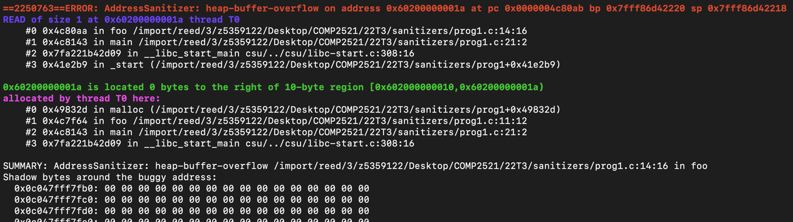

[Back to top](/)

# Reading Sanitiser Error Messages

Below is a typical error message:



Here are the different components of the error message:

### Error Type

The red line at the top describes the type of error that occurred, in this case a `heap-buffer-overflow`. See the [glossary](/glossary) for what each error type means.


### Stack Traces

The error message contains at least one stack trace describing where the error occurred. Recall that function calls in C form a 'function call stack'. A stack trace is then a representation of the function call stack that led to the error.  

The format of each line in the stack trace is `... in func file:line:col`. This means something happened in the function `func()` which is in the file `file` at line `line` and column `col`.
The first line tells you **where the error occurred**. Then, each of the lines below **which functions were called** and where leading up to the error.

Let's take a close look at the first stack trace in the example above. You may want to check out the [code](prog1.c) that caused the error.
```
    #0 0x4c80aa in foo /import/reed/3/z5359122/Desktop/COMP2521/22T3/sanitizers/prog1.c:14:16
    #1 0x4c8143 in main /import/reed/3/z5359122/Desktop/COMP2521/22T3/sanitizers/prog1.c:21:2
    #2 0x7fa221b42d09 in __libc_start_main csu/../csu/libc-start.c:308:16
    #3 0x41e2b9 in _start (/import/reed/3/z5359122/Desktop/COMP2521/22T3/sanitizers/prog1+0x41e2b9)
```
From here we can see that:
- The error occurred in the function `foo()` in `prog1.c` at line 14
- `foo()` was called from `main()` in `prog1.c` at line 21
- Some other things happen before `main()` is actually called

An error may have additional stack traces, for a description of what they all represent see the glossary page for the error type.


### Shadow Bytes
   
The large grid at the bottom is a map of the "shadow bytes" used by the sanitiser algorithm. In this course, you can usually ignore this. More information can be found [here](https://learn.microsoft.com/en-us/cpp/sanitizers/asan-shadow-bytes).

## Runtime Errors
Another class of error output by sanitisers is a runtime error. These indicate something has gone wrong that may not necessarily have caused the program to crash
.

Below is an example of such an error:


These error messages are much easier to digest. The file/line number where the error occurred is shown in the same format as with the stack traces, followed by a clear description of the error.