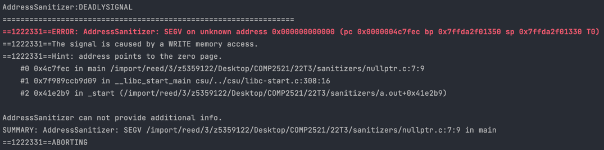

[Back to glossary](..)

# SEGV on unknown address

A `SEGV on unknown address` occurs when you try to access an unknown address (duh). This is an address that is not currently being used by your program, nor near any other memory currently being used.

The most common cause of this error is accessing a NULL pointer, as well as using uninitialised pointers or array indexes.

**Note**: If you suspect the problem is an uninitialised value, it's a good idea to compile with `MemorySanitizer` instead of `AddressSanitizer` to get a much more helpful [use-of-uninitialized-value](../use-of-uninitialized-value) error. See how to switch [here](../../sanitisers#switching-between-sanitisers).

## Reading the error message

This is a typical `SEGV on unknown address` message:

Here is the useful information you can get from this error message:

### Access Type
The second line is `The signal is caused by a READ/WRITE memory access`.

This tells us whether the error occurred due to reading from or writing to an invalid address. If you have a line like `dest[i] = src[i]` with both reading and writing, this can tell you whether the error is with reading from `src` or writing to `dest`.

### Hint
Sometimes the error message will contain a hint about what caused the error. The hints you will see are:
- `address points to the zero page` - this means you've tried to access a null pointer, which is memory address zero
- `this fault was caused by a dereference of a high value address` - this means you've tried to access a very large memory address, usually due to using an uninitialised value which tend to be very large

### Error Location
The stack trace describes where (which line/function/file) the error occurred.

## Examples

- [NULL pointer dereference](nullptr)
- [Uninitialised pointer](uninitialised-ptr)
- [Uninitialised index](uninitialised-idx)
