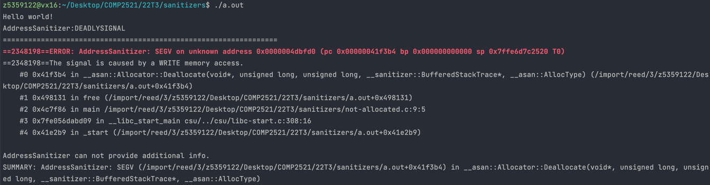

[Back to SEGV on unknown address](..)

# Freeing String Literal

## The Code

Here is the code for this example ([source](not-allocated.c)):

```c
// Created for COMP2521 sanitisers guide
#include <stdio.h>
#include <stdlib.h>

int main(void) {
    char *string;
    string = "Hello world!";
    printf("%s\n", string);
    free(string);
}

```

## The Error

Here is the error message:



- The error happened in some funky function called `__asan::Allocator::Deallocate`
- The line in our code that caused this error was line 9, when we called `free()`

## The Problem

The `free()` function allows us to deallocate memory that was previously allocated on the heap by calling `malloc()`. However, here we have tried to free the `string` variable that was assigned by writing `string = "Hello world!"`.

When we hard-code a string literal into our program like this, it gets memory allocated for it at the beginning of the program in the *data* section of the program's memory. It is not possible to free such memory, so we get an error.

## The Fix

If we know our variable will always hold a string literal and never a string that was `malloc()`'d, then we can simply not free it.

However, if the variable sometimes holds a `malloc()`'d string and sometimes a string literal (e.g. the string literal is a default value), then things get a little complicated, since there's no simple way to check whether memory was allocated on the heap or not.

One solution is to simply allocate memory for these string literals using functions like `strdup()`, meaning it is perfectly fine to free it. Line 7 in the code above would become
```c
string = strdup("Hello world!");
```

Another solution which avoids allocating unnecessary memory is to initialise the string pointer to `NULL` by default. Whenever we need to use the string, we can check if it's NULL and use our default string literal instead. For example, we could change line 8 to:
```c
printf("%s\n", string != NULL ? string : "Hello world!");
```

This solution only really makes sense if the value we want to use in the case of NULL is always the same/predictable in some way.
