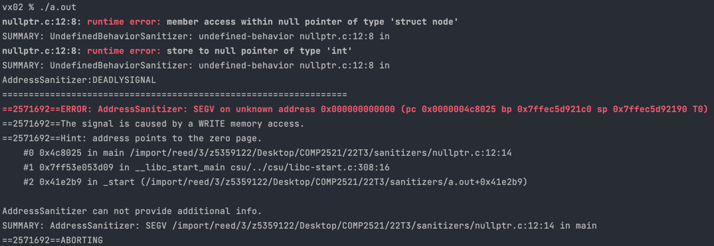

[Back to SEGV on unknown address](..)

# NULL Pointer Dereference

## The Code

Here is the code for this example ([source](nullptr.c)):

```c
// Created for COMP2521 sanitiser guide

#include <stdlib.h>

struct node {
    int value;
    struct node *next;
};

int main(void) {
    struct node *n = NULL;
    n->value = 69;
    n->next = NULL;
}

```

## The Error

Here is the error message:



- We get runtime errors telling us that we tried to access a `struct node` NULL pointer, and that we tried to write (store) an `int`
- The hint tell us this error comes from accessing a NULL pointer
- The error occurs on line 7 - `n->value = 69;`

## The Problem

The pointer accessed on line 7 is `n`, since we try to write to one of its fields using `->`. Since the issue is accessing a NULL pointer, this tells us that `n` is NULL (which we knew already).

## The Fix

Avoid this error by adding an if statement checking whether `n` is NULL before trying to access it, or try figure out why `n` is NULL and fix that.
