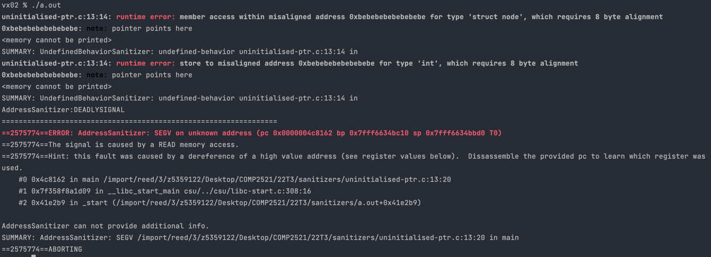

[Back to SEGV on unknown address](..)

# Uninitialised Pointer

## The Code

Here is the code for this example ([source](uninitialised-ptr.c)):

```c
// Created for COMP2521 sanitiser guide

#include <stdlib.h>

struct node {
    int value;
    struct node *next;
};

int main(void) {
    struct node *n = malloc(sizeof(*n));
    n->value = 0;
    n->next->value = 1;
}

```

This code tries to create a linked list containing the values `0` and `1`.

## The Error

Here is the error message:



- We have multiple runtime errors about trying to access address `0xbebebebebebebebe`
- The hint tells us we tried to access a large address (likely uninitialised)
- The error occurs on line 13 - `n->next->value = 1;`

## The Problem

`0xbebebebebebebebe` is the value LeakSanitizer uses for uninitialised pointers. This means the pointer we are trying to access is uninitialised. This is further supported by the hint.

On line 13, we try to set the value of `n->next`. However, when we allocated memory for `n` we never initialised `n->next`, so writing to it causes an error.

## The Fix

We need to initialise `n->next` by allocating memory to it (i.e. `n->next = malloc(...)`).