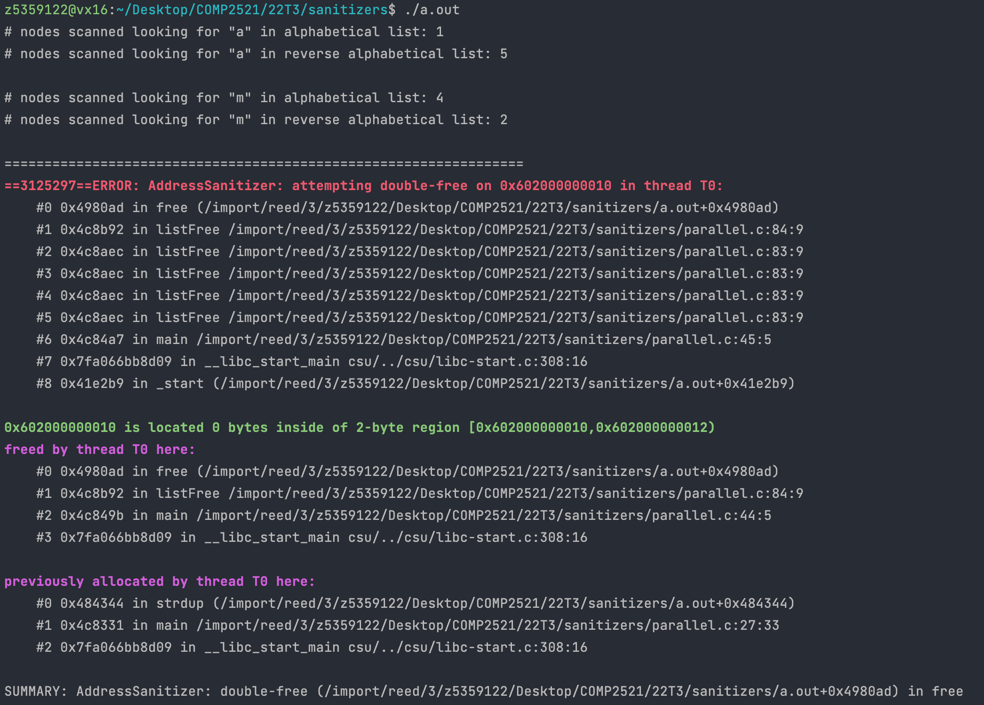

[Back to attempted double-free](..)

# Parallel data structures

## The Code

Here is the code for this example ([source](parallel.c)):

```c
// Created for COMP2521 sanitiser guide
#include <stdio.h>
#include <stdlib.h>
#include <string.h>

#define N 5

struct node {
char *data;
struct node *next;
};

struct node *listAppend(struct node *list, char *data);
struct node *listPrepend(struct node *list, char *data);
struct node *newNode(char *data);
int listFind(struct node *list, char *data);
void listFree(struct node *list);

int main(void) {
    // Create two lists for different orders
    struct node *alphabetical = NULL;
    struct node *reverse = NULL;
    
    // Insert the following strings into both
    char *strings[N] = {"a", "c", "g", "m", "t"};
    for (int i = 0; i < N; i++) {
        char *allocatedString = strdup(strings[i]);
        alphabetical = listAppend(alphabetical, allocatedString);
        reverse = listPrepend(reverse, allocatedString);
    }
    
    printf("# nodes scanned looking for \"a\" in alphabetical list: %d\n",
           listFind(alphabetical, "a"));
    printf("# nodes scanned looking for \"a\" in reverse alphabetical list: %d\n",
           listFind(reverse, "a"));
    printf("\n");
    
    printf("# nodes scanned looking for \"m\" in alphabetical list: %d\n",
           listFind(alphabetical, "m"));
    printf("# nodes scanned looking for \"m\" in reverse alphabetical list: %d\n",
           listFind(reverse, "m"));
    printf("\n");
    
    listFree(alphabetical);
    listFree(reverse);
}

struct node *listAppend(struct node *list, char *data) {
    if (list == NULL) {
        return newNode(data);
    } else {
        list->next = listAppend(list->next, data);
        return list;
    }
}

struct node *listPrepend(struct node *list, char *data) {
    struct node *n = newNode(data);
    n->next = list;
    return n;
}

struct node *newNode(char *data) {
    struct node *n = malloc(sizeof(*n));
    n->data = data;
    n->next = NULL;
    return n;
}

// Returns the number of nodes searched while looking for data
int listFind(struct node *list, char *data) {
    if (list == NULL) {
        return 0;
    } else if (strcmp(list->data, data) == 0) {
        return 1;
    } else {
        return listFind(list->next, data) + 1;
    }
}

void listFree(struct node *list) {
    if (list != NULL) {
        listFree(list->next);
        free(list->data);
        free(list);
    }
}


```

This code creates two linked lists containing strings - one sorted alphabetically and another sorted reverse-alphabetically.

It runs some operations to demonstrate that:
- It is faster to search for strings that are earlier in the alphabet in the alphabetically sorted list.
- It is faster to search for strings that are later in the alphabet in the reverse-alphabetically sorted list.

Of course, a doubly-linked list or an array would be better in terms of space complexity than this method.

## The Error

Here is the error message:



- The first stack trace tells us:
  - The error occurs on line 84 inside `listFree()` - this line is `free(list->data)`
  - It occurred 5 recursions deep i.e. it is the node at the end of a list
  - It happened as a result of calling `listFree()` on line 45 on `main()` - this is the line `listFree(reverse)`
- The second stack trace tells us:
  - The memory was first freed on line 84 inside `listFree()` - this line is `free(list->data)`
  - Specifically, it happens when we called `listFree()` on line 44 - this is the line `listFree(alphabetical)`
- The final stack trace tells us:
  - The freed memory was first allocated on line 27 of the `main()` function
  - This is where we called `strdup()` to allocate memory for each string

## The Problem

From the error message, we can see that the error occurs because we have tried to free the data in the `reverse` list, but it was already freed when freeing the `alphabetical` list.

The reason this happens is that in `newNode()`, the line `n->data = data` is essentially saying "the `data` field of this node points to the same string that `data` points to".

On line 28/29 when inserting into each list, we pass the `allocatedString` pointer to both function - this means that, as stated above, both new nodes in each list will point to `allocatedString`. This means when we go to free each list, we end up trying to free the same memory twice.

## The Fix

The simple solution is to store a *copy* of the string in each data structure. We could change `newNode()` to use the `strdup()` function e.g.
```c
n->data = strdup(data);
```
This means both lists store independent copies, and so they are both freed independent of each other, meaning there are no issues.

However, this means we are wasting a lot of memory by making all these copies. If both data structures store *exactly the same* data (i.e. there are no items that are in one data structure but not in the other), then there's another option with less memory usage.

We can add an extra parameter to our `listFree()` function that decides whether the data should be freed e.g.
```c
void listFree(struct node *list, bool freeData) {
    if (list != NULL) {
        listFree(list->next, freeData);
        if (freeData) free(list->data);
        free(list);
    }
}
```
Now when we free our lists, we call `listFree()` with `freeData` set to `true` on one of our lists, and set it to `false` when freeing the other(s). For example,
```c
listFree(alphabetical, true);
listFree(reverse, false);
```