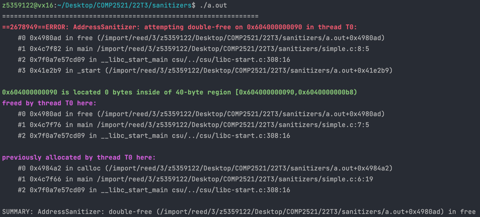

[Back to attempted double-free](..)

# Simple double free

## The Code

Here is the code for this example ([source](simple.c)):

```c
// Created for COMP2521 UNSW sanitisers guide
#include <stdio.h>
#include <stdlib.h>

int main(void) {
    int *zeroes = calloc(10, sizeof(int));
    free(zeroes);
    free(zeroes);
}

```

This code allocates an array of zeroes, then frees this array, then attempts to free it again.


## The Error

Here is the error message:



- The first stack trace tells us:
    - The error occurs on line 8 inside `main()`
    - This line is the second `free(zeroes)`;
- The second stack trace tells us:
    - The memory was first freed in line 7 inside `main()`
    - This line is the first `free(zeroes);`
- The final stack trace tells us:
  - The freed memory was first allocated on line 6 inside `main()` 
  - This is where we called `calloc()` to allocate the array

## The Problem

From the error message, we can see that the error comes from trying to free the `zeroes()` array twice - once on line 7 and then again on line 8.

## The Fix

Remove one of the `free()`s.
