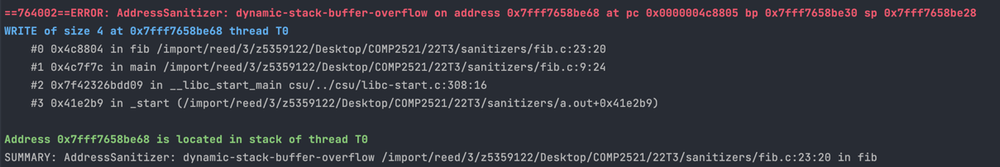

[Back to glossary](..)

# dynamic-stack-buffer-overflow

A `dynamic-stack-buffer-overflow` occurs when you attempt to access memory outside a variable-length array (VLA). This is, an array that has been initialised as `array[n]` where `n` is a variable.

VLAs are allocated on the stack, since they are a local variable of the function. The "dynamic" is because, unlike all other local variables, the amount of memory needed for a VLA cannot be known at compile time. Hence, memory is dynamically allocated as needed.

**Note**: The COMP2521 style guide forbids using VLAs. Instead, you should dynamically allocate an array using `malloc()`. On top of the reasons listed in the style guide, it means anything that produces this error would instead produce a [heap-buffer-overflow](../heap-buffer-overflow), which is significantly more descriptive.

## Reading the error message

This is a typical `dynamic-stack-buffer-overflow` message:

Here is the useful information you can get from this error message:

### Access Type
The blue line starts with `READ/WRITE of size N`.

Firstly, this tells us whether the error occurred due to reading from or writing to an invalid address. If you have a line like `dest[i] = src[i]` with both reading and writing, this can tell you whether the error is with reading from `src` or writing to `dest`.

This also gives some hints to the type of the memory you tried to access. For example if `N=4` then we might be trying to access an integer which is 4 bytes.

### Error Location
The first stack trace describes where (which line/function/file) the error occurred. See [here](../../errmsg#stack-traces) for a guide on reading stack traces.

## Examples

- [Index out of bounds](fib)
