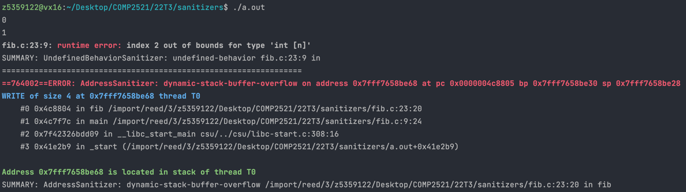

[Back to dynamic-stack-buffer-overflow](..)

# Index Out of Bounds

## The Code

Here is the code for this example ([source](fib.c)):

```c
// Written for COMP2521 sanitisers guide

#include <stdio.h>

int fib(int n);

int main(void) {
    for (int i = 0; i < 10; i++) {
        printf("%d\n", fib(i));
    }
}

// Calculates the nth Fibonacci number iteratively
int fib(int n) {
    // fib(0) = 0, fib(1) = 1
    if (n <= 1) return n;
    
    int results[n];
    results[0] = 0;
    results[1] = 1;
    
    for (int i = 2; i <= n; i++) {
        results[i] = results[i - 2] + results[i - 1];
    }
    
    return results[n];
}

```

This program prints the first 10 Fibonacci numbers. It uses the `fib()` function, which iteratively calculates the nth Fibonacci number. It uses a variable-length array to store results so they can be used in calculating the next numbers.

## The Error

Here is the error message:



- We got a runtime error telling us that we used index 2 and that was out of bounds of something
- This was a write error
- The error occurred on line 23 inside `fib()` - this is `results[i] = results[i - 2] + results[i - 1]`

## The Problem

There are three memory accesses in line 23, though since we know it's a write error, then we know it's the `results[i]` causing an error (the other two are reads). We also know that using index 2 caused the error.

The program never printed `fib(2)` so this was probably when the error occurred. We created a VLA of length `n`, which in this case is 2, and index 2 in an array of length 2 is out of bounds.

## The Fix

The array is one element too small, so we simply need to increase the size by 1. While we're at it, we should really change the array to be allocated using `malloc()`. So the fixed line would be
```c
int *results = malloc((n + 1) * sizeof(int));
```
Now we need to remember to add a `free(results)` before returning though!
