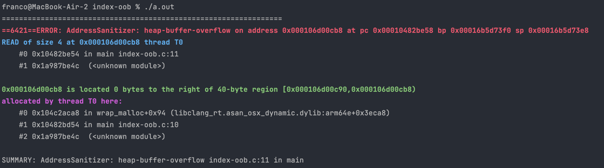

[Back to glossary](..)

# heap-buffer-overflow

A `heap-buffer-overflow` occurs when you attempt to access memory outside what has been allocated on the heap. Memory allocated via functions like `malloc()` and `calloc()` are allocated on the 'heap' section of memory.

Common causes include accessing an index out of bounds of a dynamically allocated array, or allocating insufficient memory.

## Reading the error message

This is a typical `heap-buffer-overflow` message:

Here is the useful information you can get from this error message:

### Access Type
The blue line starts with `READ/WRITE of size N`.

Firstly, this tells us whether the error occurred due to reading from or writing to an invalid address. If you have a line like `dest[i] = src[i]` with both reading and writing, this can tell you whether the error is with reading from `src` or writing to `dest`.

This also gives some hints to the type of the memory you tried to access. For example if `N=4` then we might be trying to access an integer which is 4 bytes.

### Error Location
The first stack trace describes where (which line/function/file) the error occurred.

### Incorrectly Accessed Memory Details

Most of the time, the sanitiser can also determine what memory you were trying to access when the error occurred.

#### Relative Location of Access

The green line says `located X bytes to the left/right of N-byte region`.

The left/right tells you whether you are accessing before the start/after the end of the allocated memory. To the left usually means you are using a negative index to an array, and to the right means you are using an index that is too high.

The size of the allocated memory (`N`) can give you a hint if you've allocated insufficient memory. For example, if you've meant to allocate memory for a struct but there's only an 8-byte region allocated, you may have only allocated enough memory for the pointer.

The number of bytes left/right (`X`) can sometimes be helpful to quickly tell you what index you've used. For example, if it's 0 to the right and your array is size 10 then you've used index 10, which is just past the end of the array.

#### Allocation Location

The second stack trace below the green line describes where (which line/function/file) the incorrectly accessed memory was initially allocated.

This might be useful if you want to double-check the line where you allocated the memory to make sure you're allocating sufficient memory.

## Examples

- [Index out of bounds (simple)](index-oob-simple)
- [Index out of bounds](index-oob)
- [Insufficient memory for struct](insufficient-allocation)
- [Insufficient memory for array](insufficient-allocation-array)
