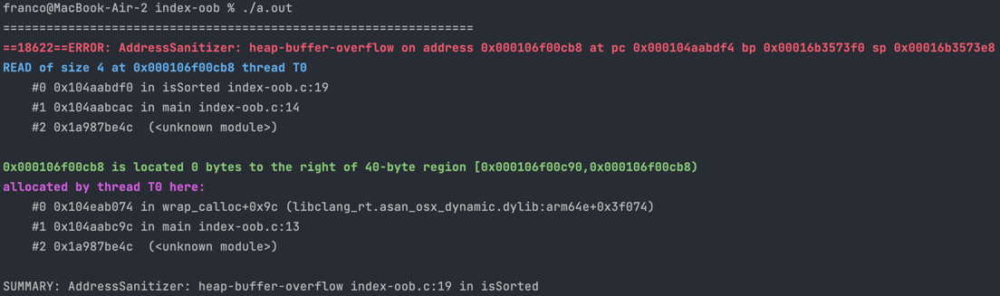

[Back to heap-buffer-overflow](..)

# Index Out of Bounds

## The Code

Here is the code for this example ([source](index-oob.c)):

```c
// Accesses an array out of bounds
// Written for COMP2521 sanitiser guide

#include <stdbool.h>
#include <stdio.h>
#include <stdlib.h>

#define N 10

bool isSorted(int *arr, int size);

int main(void) {
    int *zeroes = calloc(N, sizeof(int));
    printf("Is sorted: %s", isSorted(zeroes, N) ? "yes" : "no");
}

bool isSorted(int *arr, int size) {
    for (int i = 0; i < size; i++) {
        if (arr[i] > arr[i + 1]) {
            return false;
        }
    }
    return true;
}

```

This program `calloc()`s an array of zeroes of size 10, then calls the `isSorted()` function to determine whether it is sorted and prints the result.

`isSorted()` loops through every pair in the array and checks if there is a pair where the first number is greater than the second number. If so, then the array is not sorted, but if no pairs meet that condition then the array is sorted.

## The Error

Here is the error message:



- The first thing we notice is that the error occurs on line 19 in `isSorted()`, which is the line `if (arr[i] > arr[i + 1]) {`. This means one of these accesses of `arr` is incorrect.
- `isSorted()` was called on line 14 of `main()`, which is where we call it on `zeroes`.
- We've tried to access 0 bytes to the right of `zeroes` - `zeroes` is of size 10 so this means we tried to access index 10.

## The Problem

For some reason, either `arr[i]` or `arr[i + 1]` is trying to access index 10. Since `i` loops until `i < size`, we know that `i` can be at most 9. So `arr[i]` will always be fine, but if `i = 9` then `arr[i + 1]` will access `arr[10]` which is out of bounds.

At a higher level, remember the function considers each pair in the array (i.e. `arr[0]` and `arr[1]`, `arr[1]` and `arr[2]` etc). The loop counter `i` represents the index of the first item in the pair, but there is no pair starting at `size - 1`.

## The Fix

We need to fix our loop condition so that `i < size - 1`. This makes sure that `i + 1 < size` so `arr[i + 1]` will not cause issues.
