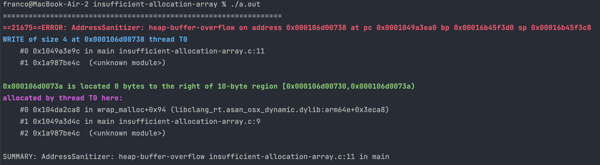

[Back to heap-buffer-overflow](..)

# Insufficient Memory for Array

## The Code

Here is the code for this example ([source](insufficient-allocation-array.c)):

```c
// Allocate insufficient memory for an array
// Created for COMP2521 sanitiser guide

#include <stdlib.h>

#define N 10

int main(void) {
    int *array = malloc(N);
    for (int i = 0; i < N; i++) {
        array[i] = i;
    }
    
    free(array);
    return 0;
}

```

## The Error

Here is the error message:



- The error occurs on line 11, which is the line `array[i] = i;`.
- The memory being incorrectly accessed was allocated on line 9, which is `int *array = malloc(N);`.
- The memory allocated for `array` was only 10 bytes.

## The Problem

Since an integer is 4 bytes, we would expect an array of 10 integers to be 40 bytes. However, as the error message states, the array was only 10 bytes.

This means that when we try to access an element of the array that is more than 10 bytes into the array (e.g. `array[3]`), we are accessing beyond what was allocated, and we get a `heap-buffer-overflow`.

## The Fix

Remember that when allocating an array we want to allocate `num_items * sizeof(item_type)`. In this case, we forgot to include the `sizeof(int)` when allocating `array`. We want to malloc `N * sizeof(int)` bytes.
