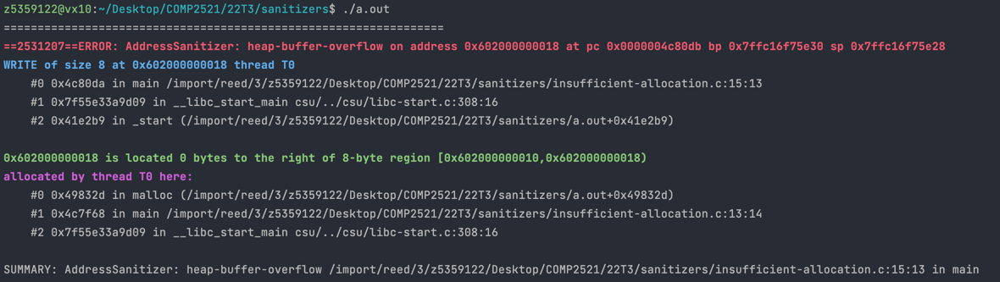

[Back to heap-buffer-overflow](/glossary/heap-buffer-overflow)

# Index Out of Bounds

## What's the error?

Here is the code for this example ([source](insufficient-allocation.c)):

```C
// Allocate insufficient memory for a struct
// Created for COMP2521 sanitiser guide

#include <stdio.h>
#include <stdlib.h>

typedef struct node *Node;
struct node {
    int val;
    Node next;
};

int main(void) {
    Node n = malloc(sizeof(Node));
    n->val = 0;
    n->next = NULL;

    free(n);
    return 0;
}

```

Here we've defined a linked list node struct `struct node` and a pointer to it called `Node`. In the main function, we've allocated memory for a new node, however we only allocated `sizeof(Node)` bytes, which gives us enough memory for the pointer, but not necessarily enough for the struct.

## How to debug?

Here is the error message:



- The first thing we notice is that the error occurs on line 16, which is the line `n->next = NULL;`.
- The memory being incorrectly accessed was allocated on line 14, which is `Node n = malloc(sizeof(Node));`.
- The memory allocated for the node was only 8 bytes, however we would expect at least 12 bytes for an integer and a pointer, so we've probably not allocated enough memory.

## How to fix?

Rather than `sizeof(Node)`, we should use `sizeof(struct node)` or `sizeof(*n)` (i.e. the size of the memory that `n` points to).
