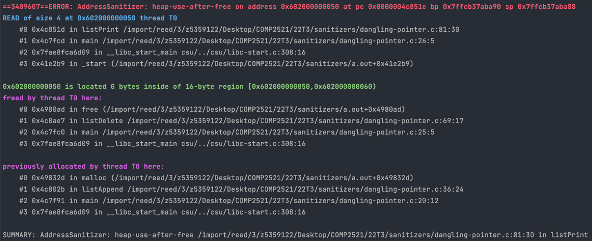

[Back to glossary](..)

# heap-use-after-free

An `heap-use-after-free` occurs when you try to access memory that has already been freed. Common causes include leaving dangling pointer to freed memory, or situations where multiple places point to the same memory.

## Reading the error message

This is a typical `heap-use-double-free` message:

Here is the useful information you can get from this error message:

### Access Type
The blue line starts with `READ/WRITE of size N`.

Firstly, this tells us whether the error occurred due to reading from or writing to freed memory. If you have a line like `dest[i] = src[i]` with both reading and writing, this can tell you whether the error is with reading from `src` or writing to `dest`.

This also gives some hints to the type of the memory you tried to access. For example if `N=4` then we might be trying to access an integer which is 4 bytes.

### Error Location
The first stack trace describes where (which line/function/file) the error occurred i.e. where we tried to access the memory. See [here](../../errmsg#stack-traces) for a guide on reading stack traces.

### Free Location
The second stack trace below `freed by...` describes where (which line/function/file) the memory we tried to access was freed. See [here](../../errmsg#stack-traces) for a guide on reading stack traces.

### Initial Allocation Location

The third stack trace below `previously allocated by...` describes where (which line/function/file) the memory we tried to access was initially allocated. See [here](../../errmsg#stack-traces) for a guide on reading stack traces.

## Examples

- Freeing returned memory
- [Dangling pointer](dangling-pointer)
- False copy
- BST cycle
