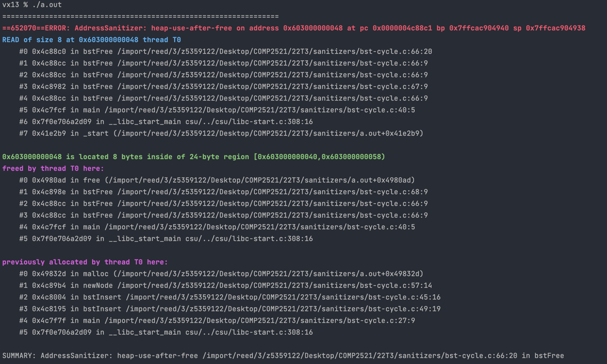

[Back to heap-use-after-free](..)

# BST Cycle

## The Code

Here is the code for this example ([source](bst-cycle.c)):

```c
// Created for COMP2521 sanitiser guide

#include <stdio.h>
#include <stdlib.h>

typedef struct bst BST;
struct bst {
    int value;
    BST *left;
    BST *right;
};

BST *bstInsert(BST *t, int value);
BST *newNode(int value);
void bstFree(BST *t);
BST *rotateLeft(BST *t1);

int main(void) {
    // Create a tree like
    //   2
    //  / \
    // 1   4
    //    / \
    //   3   5
    BST *t = NULL;
    t = bstInsert(t, 2);
    t = bstInsert(t, 1);
    t = bstInsert(t, 4);
    t = bstInsert(t, 3);
    t = bstInsert(t, 5);
    
    // Rotate it left to be
    //     4
    //    / \
    //   2   5
    //  / \
    // 1   3
    t = rotateLeft(t);
    
    bstFree(t);
}

BST *bstInsert(BST *t, int value) {
    if (t == NULL) {
        return newNode(value);
    }
    
    if (value < t->value) {
        t->left = bstInsert(t->left, value);
    } else if (value > t->value) {
        t->right = bstInsert(t->right, value);
    }
    return t;
}

BST *newNode(int value) {
    BST *t = malloc(sizeof(*t));
    t->value = value;
    t->left = NULL;
    t->right = NULL;
    return t;
}

void bstFree(BST *t) {
    if (t != NULL) {
        bstFree(t->left);
        bstFree(t->right);
        free(t);
    }
}

BST *rotateLeft(BST *t1) {
    if (t1 == NULL || t1->right == NULL) return t1;
    BST *t2 = t1->right;
    t1->right = t2;
    t2->left = t1;
    return t2;
}

```

This code creates a BST (see comments in code for structure) and then performs a left rotation on it.


## The Error

Here is the error message:



- The first stack trace tells us:
    - The error occurs on line 66 inside `bstFree()` - this line is `if (l->head == NULL) {`
    - This happened 5 levels of recursion deep
    - `bstFree()` was initially called from line 40 of `main()`
- The second stack trace tells us:
    - The memory was freed in line 68 inside `bstFree()`
    - This also happened when we called `bstFree()`on line 40 of `main()`
- The final stack trace tells us:
    - The freed memory was first allocated when we called `bstInsert()` line 27 of `main()` - this is when we inserted 1

## The Problem

From the error message we can see that, when we free the tree, a node is accessed after it has been freed, meaning we're trying to free it twice in one go. We can also tell that it was the node containing 1, but that doesn't help much. Our first thought might be that `bstFree()` is wrong. However, we can see that we've pretty much implemented a **post-order** traversal, which we know only visits each node once. 

The only way we could visit a node twice is if a node is somehow a descendent of itself i.e. we have a **cycle** in our tree. The fact that `bstFree()` has recursed 5 levels deep despite there only being 3 levels in our tree is another give away that a cycle exists.

This could either be from `bstInsert()` or `rotateLeft()`. We can comment out the rotation to see that no error occurs, so this confirms that `rotateLeft()` is the issue.

The problem is actually just a small typo. In the 3rd line of the function, we set `t1->right = t2` which means the original root `t1` now points up at the new root `t2`. Ethan has drawn a lovely diagram to visualise what's gone wrong:


So, our tree actually looks something like this
```
     4
    /^\
   2_| 5
 /
1
```
where 4 is the right child of 2, but also it's parent. So, when we go to free this tree, here's what happens:

- Free root (4)
  - Free 4's left (2)
    - Free 2's left (1)
      - Free 1's left (NULL)
      - Free 1's right (NULL)
      - Actually free 1
    - Free 2's right (4)
      - Free 4's left (2)
        - Free 2's left (FREED)
          - Free FREED's left - ERROR!

## The Fix

We just need to fix our typo, and change `t1->right = t2` to `t1->right = t2->left`.
