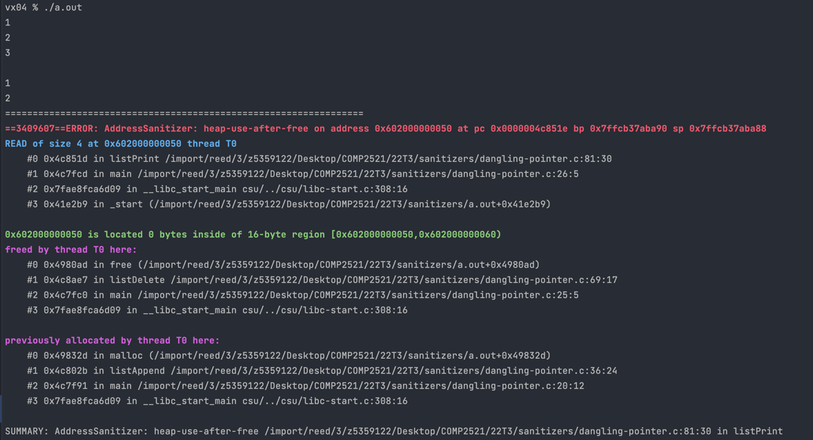
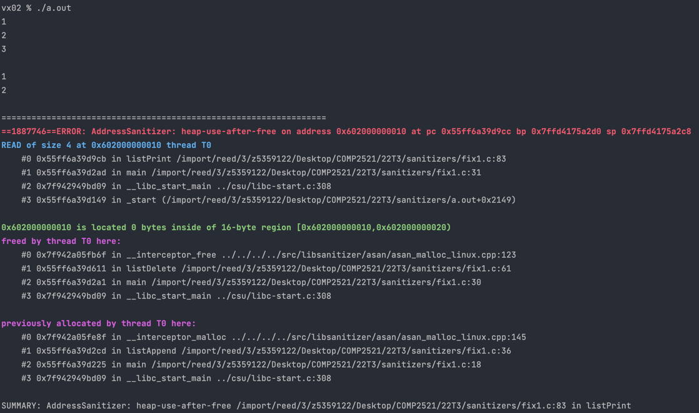

[Back to heap-use-after-free](..)

# Dangling Pointer

## The Code

Here is the code for this example ([source](dangling-pointer.c)):

```c
// Created for COMP2521 sanitiser guide

#include <stdio.h>
#include <stdlib.h>

struct node {
    int value;
    struct node *next;
};

struct node *listAppend(struct node *list, int value);
struct node *listDelete(struct node *list, int value);
void listPrint(struct node *list);

int main(void) {
    // Create list 1 -> 2 -> 3 -> X
    struct node *list = NULL;
    list = listAppend(list, 1);
    list = listAppend(list, 2);
    list = listAppend(list, 3);
    listPrint(list);
    printf("\n");
    
    // Delete 3
    listDelete(list, 3);
    listPrint(list);
    printf("\n");
    
    // Delete 1
    listDelete(list, 1);
    listPrint(list);
}

// Append a value to the end of a list
struct node *listAppend(struct node *list, int value) {
    struct node *new = malloc(sizeof(*new));
    new->value = value;
    new->next = NULL;

    // List is empty
    if (list == NULL) {
        return new;
    }
    
    struct node *curr = list;
    while (curr->next != NULL) {
        curr = curr->next;
    }
    curr->next = new;
    return list;
}

// Delete the first occurrence of a value from a list
struct node *listDelete(struct node *list, int value) {
    if (list == NULL) {
        // Empty list
        return NULL;
    } else if (list->value == value) {
        // Head contains value
        struct node *newHead = list->next;
        free(list);
        return newHead;
    } else {
        // Loop and find value
        struct node *curr = list;
        while (curr != NULL && curr->next != NULL) {
            if (curr->next->value == value) {
                // Next node contains value, free it
                free(curr->next);
                break;
            }
            curr = curr->next;
        }
        return list;
    }
}

// Print out a list
void listPrint(struct node *list) {
    for (struct node *curr = list; curr != NULL; curr = curr->next) {
        printf("%d\n", curr->value);
    }
}

```

This code create a linked list containing `1, 2, 3`, then deletes `3`, then deletes `1`, printing out the list after each operation.

We're using standard linked list operations
- **append** - return a new node if empty, otherwise loop to the end and add it there
- **delete** - do nothing if empty, free the head and return it's next if deleting the head, otherwise loop through to find the node just before the node we want to delete then free the node
- **print** - loop through and print all values

## The Error

Here is the error message:



- The first stack trace tells us:
  - The error occurs on line 81 inside `listPrint()` (this line is `printf("%d\n", curr->value);`)
  - This happened when we called `listPrint()` from line 26 of `main()` - this is the second print after deleting 3
- The second stack trace tells us:
  - The memory was freed in line 69 inside `listDelete()` (this line is `free(curr->next)`)
  - This happened when we called `listDelete()`on line 25 of `main()` (this is `listDelete(list, 3)`)
- The final stack trace tells us:
  - The freed memory was first allocated when we called `listAppend()` on line 20 of `main()` (this line is `list = listAppend(list, 3)`)

## The Problem

We know the error comes from printing the list, so there's a freed node we're accessing somewhere, but we can't be too sure which.

The memory was freed when we called `listDelete(list, 3)`, so this suggests we're trying to access the memory that used to hold the node containing 3. However, it's possible we made an error and freed the wrong node.

We also know that the freed memory was allocated when we called `listAppend(list, 3)` - this confirms that the memory in question is the memory for 3.

Putting it all together, after freeing 3, `listPrint` was somehow able to access the pointer to 3. This means that after freeing, we left a "dangling pointer" to the freed memory. The only pointer to 3 was the one from 2, and taking a look at `listDelete()`, we forgot to update 2 to point to something else.

To help visualise things, this is what our list looks like after we deleted 3:
```
list -> 1 -> 2 -> ?
```
where `?` represents freed memory, where instead we want it to look like:
```
list -> 1 -> 2 -> X
```

## The Fix

Whenever we free memory, we need to make sure to update all pointers that pointed to this memory. Often we set the pointers to NULL, or update them to a new value.

In this case, we should point 2 to whatever 3 previously pointed to. So, we should change the freeing code to do this

```c
// Next node contains value, free it
struct node *tmp = curr->next;
curr->next = curr->next->next;
free(tmp);
break;
```
This fix is implemented in [fix1.c](fix1.c).

## The Error 2?!

Uh-oh, `fix1.c` still gives an error!



- The first stack trace tells us:
    - The error occurs on line 83 inside `listPrint()` (this line is `printf("%d\n", curr->value);`)
    - This happened when we called `listPrint()` from line 31 of `main()` - this is the third print after deleting 1
- The second stack trace tells us:
    - The memory was freed in line 61 inside `listDelete()` (this line is `free(list)`)
    - This happened when we called `listDelete()`on line 30 of `main()` (this is `listDelete(list, 1)`)
- The final stack trace tells us:
    - The freed memory was first allocated when we called `listAppend()` on line 18 of `main()` (this line is `list = listAppend(list, 1)`)

## The Problem 2

Following the same process as above, this error happened because after freeing 1 we left another "dangling pointer". 1 was the head of the list, so the only pointer to it was the `list` variable in the main function. We need to make sure this is updated.


To help visualise things, this is what our list looks like after we deleted 1:
```
list -> ?   2 -> X
```
where `?` represents freed memory, where instead we want it to look like:
```
list -> 2 -> X
```

## The Fix 2

Remember that all list modifying functions should return the head of the list. This is because in some cases the head of the list is updated (e.g. adding to/deleting from the front of list). In these cases, the caller needs to know what the new head is, meaning it needs to be returned.

In our code, while we do return the new head, our `main()` function doesn't _save_ the new head. So after deleting 1, even though the head has now changed to 2, `list` still points to the old head (1). To fix this, we just need to save the new head like this

```c
list = listDelete(list, 3);
...
list = listDelete(list, 1);
```
