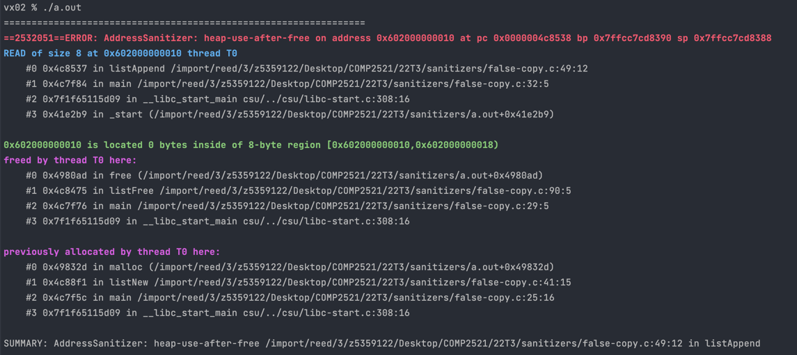

[Back to heap-use-after-free](..)

# False Copy

## The Code

Here is the code for this example ([source](false-copy.c)):

```c
// Created for COMP2521 sanitiser guide

#include <stdio.h>
#include <stdlib.h>

typedef struct list List;
struct list {
    struct node *head;
};

typedef struct node Node;
struct node {
    int value;
    Node *next;
};

List *listNew();
void listAppend(List *l, int value);
Node *newNode(int value);
List *listCopy(List *l);
void listFree(List *l);

int main(void) {
    // Create a list
    List *l1 = listNew();
    
    // Create a copy and free the original
    List *l2 = listCopy(l1);
    listFree(l1);
    
    // Add nodes to the copy
    listAppend(l2, 1);
    listAppend(l2, 2);
    listAppend(l2, 3);
    
    listFree(l2);
}

// Create new empty list
List *listNew() {
    List *l = malloc(sizeof(*l));
    l->head = NULL;
    return l;
}

// Append a value to the end of a list
void listAppend(List *l, int value) {
    Node *n = newNode(value);
    if (l->head == NULL) {
        l->head = n;
    } else {
        Node *tail = l->head;
        while (tail->next != NULL) {
            tail = tail->next;
        }
        tail->next = n;
    }
}

// Create new node containing value
Node *newNode(int value) {
    Node *n = malloc(sizeof(*n));
    n->value = value;
    n->next = NULL;
    return n;
}

// Create a copy of the given list
List *listCopy(List *l) {
    if (l->head == NULL) {
        // No copying to do
        return l;
    } else {
        List *cp = listNew();
        for (Node *curr = l->head; curr != NULL; curr = curr->next) {
            listAppend(cp, curr->value);
        }
        return cp;
    }
}

// Free the given list
void listFree(List *l) {
    Node *curr = l->head;
    while (curr != NULL) {
        Node *tmp = curr;
        curr = curr->next;
        free(tmp);
    }
    free(l);
}


```

This code creates an empty linked list, copies that empty linked list, frees the original, then adds {1, 2, 3} to the copy.

We use the container representation of a linked list, and implement the following operations:
- **new** - creates a new empty linked list
- **append** - if the list is empty sets the head to be a new node containing the new value, otherwise find the tail and put the new node after it
- **copy** - if the list is empty return it, otherwise create a new list and append all the items of the original
- **free** - loop through and free each node, then free the list

## The Error

Here is the error message:



- The first stack trace tells us:
    - The error occurs on line 49 inside `listAppend()` - this line is `if (l->head == NULL) {`
    - This happened when we called `listAppend()` from line 32 of `main()` - this is when we append 1 to the copy
- The second stack trace tells us:
    - The memory was freed in line 90 inside `listFree()` - this line is `free(l)`
    - This happened when we called `listFree()`on line 29 of `main()` - this is when we free the original
- The final stack trace tells us:
    - The freed memory was first allocated when we called `listNew()` line 25 of `main()` - this is when we created the original list

## The Problem

For some reason, when we go to append nodes to the copy, we've tried to access the memory of the original list that we just freed.

This is because in the case that the original list is empty, `listCopy()` doesn't return a new distinct list but just returns the original list. This means that both `l1` and `l2` point to the same memory. When we free `l1`, this also frees `l2`, so when we try to append to `l2` we get an error.

## The Fix

When we have "copy" functions we (usually) need to make sure that the copy is completely separate from the original and does not share memory with it.

In this case, we just need to remove the case where the original list passed to `listCopy()` is empty, so the function should look like this:
```c
// Create a copy of the given list
List *listCopy(List *l) {
    List *cp = listNew();
    for (Node *curr = l->head; curr != NULL; curr = curr->next) {
        listAppend(cp, curr->value);
    }
    return cp;
}
```

This way, we always create a new list and return that.