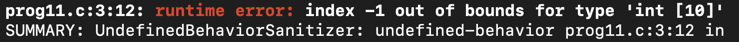
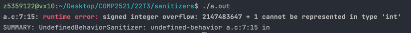
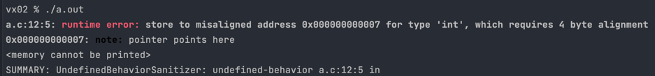
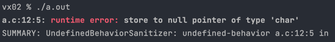

# Runtime Errors

Runtime errors all follow the same general format, they give the file and line the error occurred in, then a description  of the error.

## index out of bounds
This is probably the most descriptive and 'plain English' error out there. If you've got an array that's a certain size `N`, then the valid range of indexes is `0` up to `N - 1`. Accessing anything besides these gives you an error like the one below:

Typically, this error comes along with a [SEGV on unknown address](../SEGV-unknown-address), or [stack-buffer-overflow](../stack-buffer-overflow) error, so see the explanations and examples there for more information on debugging.

**Note**: If the index in the error message is `-1094795586` then this is definitely an uninitialised value, since this is the default value used for uninitialised values. See an example [here](../SEGV-unknown-address/uninitialised-idx).

## integer overflow
Due to how integers are represented and stored as a fixed width binary number, the numbers that can be represented as an integer is limited to some range. For example, the `int` type in C is a 32-bit signed integer, so all `int` values must be in the range [-2147483648, 2147483647] (which is [-(2^31), 2^31 - 1]).

If you tried to do store an integer outside of this range directly e.g. `int x = 2147483648;`, your compiler will probably warn you about this. However, if over the course of the program some calculation results in a value outside this range, you will get an error like the one below:

This can sometimes happen if you are using `INT_MAX` or `INT_MIN` to represent infinity or negative infinity. Be careful that you aren't doing arithmetic with these values that would produce a result outside of the representable range, such as adding to `INT_MAX` or subtracting from `INT_MIN`.

**Note**: If one of the numbers in the calculation is `-1094795586` then this is definitely an uninitialised value, since this is the default value used for uninitialised values.

## misaligned address
For efficiency reasons, the compiler will align data along certain boundaries. This means that data will always be stored at addresses that are a multiple of this boundary. For example, in the screenshot above we can see that `int` requires 4-byte alignment, so the memory address of an `int` should always be a multiple of 4.

If you try access an address that is not aligned correctly, then the sanitiser knows that this must be an invalid address, so it raises an error like the one below:

There are three types of misaligned address errors you'll get:
- `store to` means you've tried to write something to the memory address
- `load from` means you've tried to read the data at the memory address
- `member access within` means the pointer was to a struct, and you've tried to access one of its fields using `->`

Typically, this error comes along with a [SEGV on unknown address](../SEGV-unknown-address) error, so see the explanations and examples there for more information on debugging.

**Note**: If the address in the error message is `0xbebebebebebebebe` then this is definitely an uninitialised pointer, since this is the default value used for uninitialised values. See an example [here](../SEGV-unknown-address/uninitialised-ptr).

## null pointer
Hopefully this error is pretty straightforward - it occurs when you try to access a NULL pointer. Below is an example:

There are three types of null pointer errors you'll get:
- `store to` means you've tried to write something to the memory address
- `load from` means you've tried to read the data at the memory address
- `member access within` means the pointer was to a struct, and you've tried to access one of its fields using `->`

Typically, this error comes along with a [SEGV on unknown address](../SEGV-unknown-address) error, so see the explanations and examples there for more information on debugging. A specific example can be found [here](../SEGV-unknown-address/nullptr).
