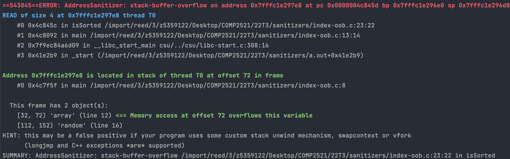

[Back to glossary](..)

# stack-buffer-overflow (or underflow)

A `stack-buffer-overflow` (or `stack-buffer-underflow`) occurs when you attempt to access memory outside what has been allocated on the stack. Local variables within functions and function arguments are allocated on the 'stack' section of memory. Each function gets its own 'stack frame', which is a section of the stack containing its local variables.

The error is an `overflow` if you try access an address that is greater than (to the right of) some variable. The error is an `underflow` if you try access an address that is less than (to the left of) some variable.

The main causes of this error is accessing an index out of bounds of a local stack-allocated array.


## Reading the error message

This is a typical `stack-buffer-overflow` message:



Here is the useful information you can get from this error message:

### Access Type
The blue line starts with `READ/WRITE of size N`.

Firstly, this tells us whether the error occurred due to reading from or writing to an invalid address. If you have a line like `dest[i] = src[i]` with both reading and writing, this can tell you whether the error is with reading from `src` or writing to `dest`.

This also gives some hints to the type of the memory you tried to access. For example if `N=4` then we might be trying to access an integer which is 4 bytes.

### Error Location
The first stack trace describes where (which line/function/file) the error occurred. See [here](../../errmsg#stack-traces) for a guide on reading stack traces.

### Accessed Address Location

The error messages shows the variables that are contained in the stack frame of the function that contains the variable we tried to access. It also gives the range of addresses occupied by each variable (given as offsets from the base address of the frame) and which line it was created on.

Note that some variables may be missing. This is because the compiler may have optimised out those variables. For example, variables that are only used once or variables with constant values are inlined.

The error message also tells you where the address you tried to access is in relation to these variables, which is the green text saying
```
<= Memory access at offset N overflows/underflows this variable
```
If the variable is an array, then how far the offset is from the array can give you a hint of what index you tried to use.

For example, in the error message above the `array` is an array of 10 ints, which is why it occupies 40 bytes in the range [32, 72). The address we tried to access was 72, which is 0 bytes past the array, meaning we tried to access index 10. Just as more examples:
- an address of 76 would suggest trying to access index 11
- an address of 28 would suggest trying to access index -1

## Examples

- [Index out of bounds (overflow)](index-oob)
- [Index out of bounds (underflow)](index-oob-under)
