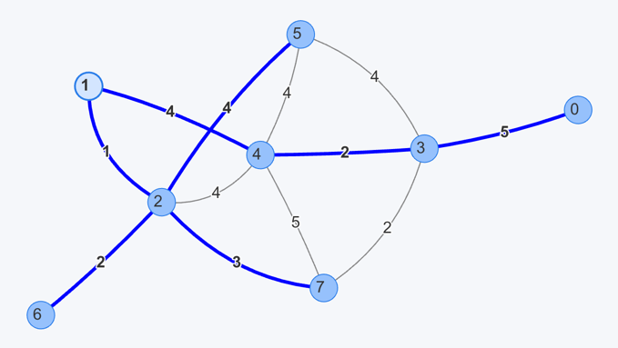
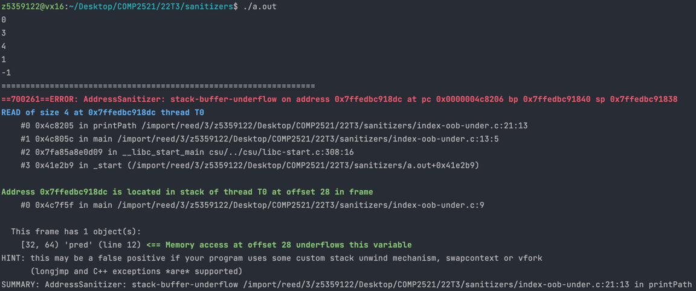

[Back to stack-buffer-overflow](..)

# Index Out of Bounds (Underflow)

## The Code

Here is the code for this example ([source](index-oob-under.c)):

```c
// Written for COMP2521 sanitiser guide

#include <stdio.h>

#define N 8

void printPath(int pred[], int dest, int nV);

int main(void) {
    // Pred array like those output by DFS/BFS/Dijkstra's
    // Source vertex is 1
    int pred[N] = { 3, -1, 1, 4, 1, 2, 2, 2 };
    printPath(pred, 0, N);
}

// Prints the path (in reverse) from src to dest according to pred
void printPath(int pred[], int dest, int nV) {
    int v = dest;
    for (int i = 0; i < nV; i++) {
        printf("%d\n", v);
        v = pred[v];
    }
}

```

This program uses a predecessor array and prints out the path from 0 to the source vertex 1 according to the predecessor array.

The predecessor array was actually generated by running Dijkstra's algorithm to find the shortest paths from 1 to all other vertices in the following graph:



## The Error

Here is the error message:



We can see that:
- The error occurs on line 21 in `printPath()`, which is the line `v = pred[v]`
- The memory address we tried to access underflows the memory for `pred` - specifically, it underflows by 4 bytes

## The Problem

Since `v = pred[v]` was the error causing line, the only possible cause is that `v` is an invalid index here. An underflow of 4 bytes suggests an index of -1 was used (since that is one integer's memory before the start of the array). The fact that the most recently printed number was -1 supports this.

The issue is that we don't stop printing the path once we reach the source vertex. Since the predecessor of the source vertex is defined as -1 here, then we go on to access `pred[-1]` which of course causes an error. The current loop condition is incorrect, since it tries to print `nV` vertices on the path, but there is most likely not this many vertices on the path.

## The Fix

We should use a `while` loop here instead - `for` loops are more suitable when we're looping from start to end of something that has a known length. Here, we're not sure how long the path is.

A suitable condition would be `while (v != -1) { ... }`, since this means we will stop the loop after reaching a node with no predecessor (which would be the source).
