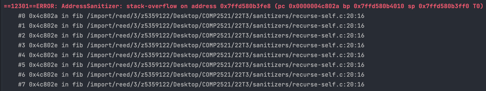
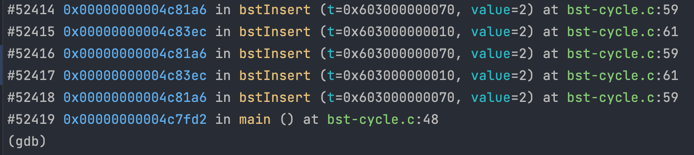

[Back to glossary](..)

# stack-overflow

Everybody's favourite. A `stack-overflow` occurs when you recurse too deep. This may be due to infinite recursion, or trying to recurse on an input size that is simply too large (e.g. recursing millions of times to mergesort an array with millions of elements).

Every time a function is called, it gets pushed on to the "function call stack" and gets popped from the stack when it returns. The stack is only so large though, and if you're continuously calling functions (pushing to the stack) without returning, you overflow the stack.

## Reading the error message

This is (the start of) a typical `stack-overflow` message:

Here is the useful information you can get from this error message:

### Error Location
The first stack trace describes where (which line/function/file) the error occurred. See [here](../../errmsg#stack-traces) for a guide on reading stack traces.

This will tell you which function is stuck in the infinite recursion, and also how you got there, but unfortunately there isn't much to help determine the cause here.

## Using GDB

Often the stack trace only shows the last couple hundred stack frames, so it's not possible to tell what initially triggered the infinite recursion with just the sanitiser error.

We can use GDB to give us the full trace though. Load the program into GDB (`gdb <program>`), run it (`run <args>`) until it hits the error, and then generate a stack trace with the `where` command. You should get a very long output with thousands of frames, but eventually it'll give you the first call:

## Examples

- [Self-recursion](recurse-self)
- [BST cycle](bst-cycle)
