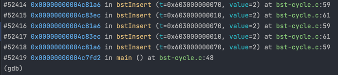

[Back to stack-overflow](..)

# BST Cycle

## The Code

Here is the code for this example ([source](bst-cycle.c)):

```c
// Created for COMP2521 sanitiser guide

#include <stdio.h>
#include <stdlib.h>

typedef struct bst BST;
struct bst {
    int value;
    BST *left;
    BST *right;
};

BST *bstInsert(BST *t, int value);
BST *newNode(int value);
void bstFree(BST *t);
BST *rotateLeft(BST *t1);

int main(void) {
    // Create a tree like
    //   1
    //  / \
    // 0   4
    //    / \
    //   3   5
    BST *t = NULL;
    t = bstInsert(t, 1);
    t = bstInsert(t, 0);
    t = bstInsert(t, 4);
    t = bstInsert(t, 3);
    t = bstInsert(t, 5);
    
    // Rotate it left to be
    //     4
    //    / \
    //   1   5
    //  / \
    // 0   3
    t = rotateLeft(t);

    // Insert 2, resulting in
    //     4
    //    / \
    //   1   5
    //  / \
    // 0   3
    //    /
    //   2
    t = bstInsert(t, 2);
    
    bstFree(t);
}

BST *bstInsert(BST *t, int value) {
    if (t == NULL) {
        return newNode(value);
    }
    
    if (value < t->value) {
        t->left = bstInsert(t->left, value);
    } else if (value > t->value) {
        t->right = bstInsert(t->right, value);
    }
    return t;
}

BST *newNode(int value) {
    BST *t = malloc(sizeof(*t));
    t->value = value;
    t->left = NULL;
    t->right = NULL;
    return t;
}

void bstFree(BST *t) {
    if (t != NULL) {
        bstFree(t->left);
        bstFree(t->right);
        free(t);
    }
}

BST *rotateLeft(BST *t1) {
    if (t1 == NULL || t1->right == NULL) return t1;
    BST *t2 = t1->right;
    t1->right = t2;
    t2->left = t1;
    return t2;
}

```

This code creates a BST (see comments in code for structure), performs a left rotation on it, and then inserts 2 into the tree.


## The Error

Here is (the start of) the error message:


- The stack trace tells us we are repeatedly recursing left (line 59) and then right (line 61) and so on
- This continues for quite some time

We only get the first couple hundred stack frames in this trace, so if we want to see the first call that caused this error, we can use GDB to get a full stack trace.

Loading and running the program in GDB, we can use the `where` command after hitting the error, which gives us the following output:



- This stack trace now tells us the error occurred when calling `bstInsert()` on line 48 of `main()` - this is where we insert 2 after rotating
- We can specifically see now that we first recurse left, then right, then left, then right etc.

## The Problem

We know our `bstInsert()` only goes down one branch of the tree until it reaches NULL, since we only ever recurse on the left/right child, never back up the tree. However, this branch seems to be infinitely long.

Going off the GDB stack trace we can see that
- We start from the root (4)
- We recurse on to the left child (1)
- We recurse on 1's right child (3)
- We recurse on 3's right child, which should be NULL
- However, we somehow recurse on the left child without error

This suggests that some node along this path has a child that is 'above' it in the tree structure i.e. we have a **cycle** in our tree.

This could either be from an incorrect `bstInsert()` or `rotateLeft()`. The first insertions seem to work fine, so it's more likely that `rotateLeft()` is the issue.

The problem is actually just a small typo. In the 3rd line of the function, we set `t1->right = t2` which means the original root `t1` now points up at the new root `t2`. Ethan has drawn a lovely diagram to visualise what's gone wrong:


So, our tree actually looks something like this
```
     4
    /^\
   1_| 5
 /
0
```
where 4 is the right child of 1, but also it's parent, and 3 has been lost. So, when we go to try insert 2, here's what happens:

- Insert 2 into the root (4)
  - Insert 2 into 4's left child (1)
    - Insert 2 into 1's right child (4)
      - Insert 2 into 4's left child (1)
        - etc.

## The Fix

We just need to fix our typo, and change `t1->right = t2` to `t1->right = t2->left`.
