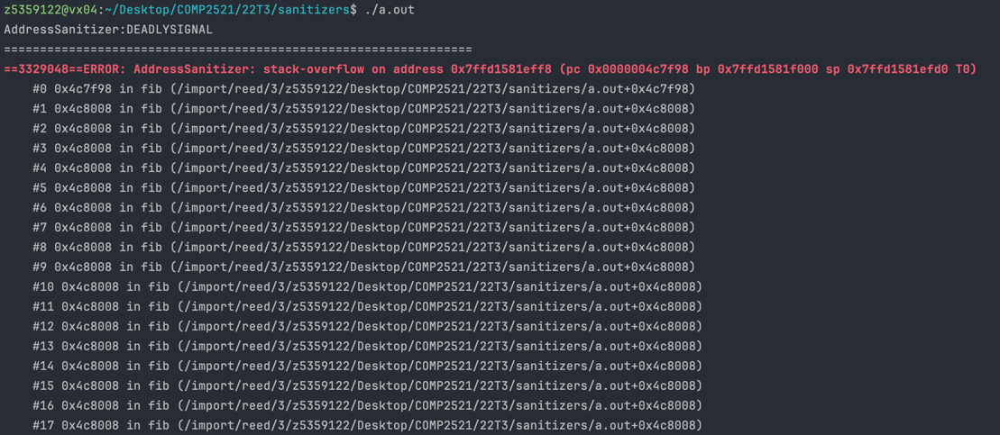

[Back to stack-overflow](..)

# Large Input

## The Code

Here is the code for this example ([source](large-input.c)):

```c
// Created for COMP2521 sanitiser guide

#include <stdio.h>

#define MOD 1000000000

int fib(int n);

int main(void) {
    printf("The last 9 digits of the millionth Fibonacci number: %d\n", fib(1000000));
}

int fib(int n) {
    if (n == 0) {
        return 0;
    } else if (n == 1) {
        return 1;
    } else {
        return (fib(n - 1) + fib(n - 2)) % MOD;
    }
}
```

This code tries to print out one millionth number of the Fibonacci sequence. However, since that is far too large to be stored in an integer or even a long/double, we only calculate the last 9 digits.

We can do this by taking advantage of the fact that (a % m + b % m) % m = (a + b) % m, so rather than needing to calculate the entirety of each Fibonacci number, we only need to store the last 9 digits, which we can obtain by taking the remainder when divided by 1 billion.

## The Error

Here is the error message:



- This error message tells us that we have repeatedly called `fib()` until we called it so much that we overflowed the stack

## The Problem

Unfortunately, the problem is simply that 1 million is far too large. To calculate this we would need to recursively call `fib()` 1 million times, and allocate 1 million stack frames. This is megabytes of data, and modern systems only allow for a stack size of a few megabytes.

## The Fix

Since we can't use recursion to solve this, we need to find an iterative solution. We can calculate Fibonacci iteratively by storing the whole sequence in an array and going from the bottom up like this:

```c
int fib[N + 1];
fib[0] = 0;
fib[1] = 1;

for (int i = 2; i <= N; i++) {
    fib[i] = (fib[i - 1] + fib[i - 2]) % MOD;
}

printf("The last 9 digits of the millionth Fibonacci number: %d\n", fib[N]);
```
