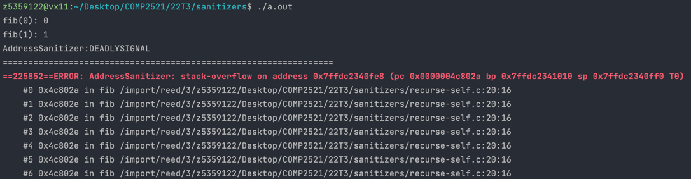

[Back to stack-overflow](..)

# Self-Recursion

## The Code

Here is the code for this example ([source](recurse-self.c)):

```c
// Created for COMP2521 sanitiser guide

#include <stdio.h>
#include <stdlib.h>

int fib(int n);

int main(void) {
    for (int i = 0; i < 10; i++) {
        printf("fib(%d): %d\n", i, fib(i));
    }
}

int fib(int n) {
    if (n == 0) {
        return 0;
    } else if (n == 1) {
        return 1;
    } else {
        return fib(n) + fib(n - 1);
    }
}

```

This code tries to print out the first 10 numbers of the Fibonacci sequence.

## The Error

Here is the error message:



- This tells us we are infinitely hitting the recursive case of `fib()` on line 20

## The Problem

Taking a look at line 20, we can see that we call `fib(n)`. However, `n` is the argument passed to this function, so calling `fib(n)` is just doing the same thing again. Since calling `fib(n)` results in calling `fib(n)` in all cases where `n > 1`, then this will result in infinitely calling `fib(n)`.

## The Fix

The correct recursion for Fibonacci's is `fib(n) = fib(n - 1) + fib(n - 2)`, so line 20 should read

```c
return fib(n - 1) + fib(n - 2);
```
