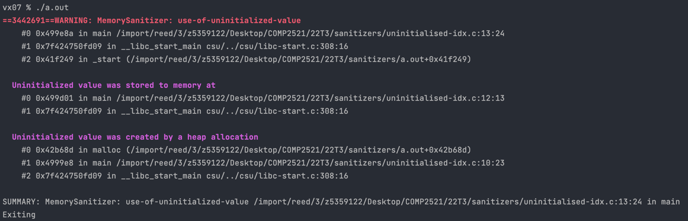

[Back to use-of-uninitialized-value](..)

# Uninitialised Index

## The Code

Here is the code for this example ([source](uninitialised-idx.c)):

```c
// Created for COMP2521 sanitiser guide

#include <stdio.h>
#include <stdlib.h>

#define N 10

int main(void) {
    int array[N] = {0, 1, 2, 3, 4, 5, 6, 7, 8, 9};
    int *printOrder = malloc(N * sizeof(int));
    for (int i = 0; i < N; i++) {
        int printIdx = printOrder[i];
        printf("%d\n", array[printIdx]);
    }
    free(printOrder);
}

```

This code creates `array` containing 0..9, then mallocs an array `printOrder` of indexes that stores the order to print out `array`.

## The Error

Here is the error message:



- The error occurs on line 13 - `printf("%d\n", array[printIdx]);`
- The uninitialised value was stored into a variable on line 12 - `int printIdx = printOrder[i];`
- The uninitialised value was originally created on line 10 - `int *printOrder = malloc(N * sizeof(int));`

## The Problem

When we allocated memory for the `printOrder` array we didn't initialise it, so each element of this array contains an uninitialised value.

We stored one of these values into `printIdx` in line 12 which we then use in line 13 when we try to print, and so get an error.

## The Fix

Make sure that the `printOrder` array is initialised. If we don't know what to put in there yet, we can initialise it to a default like `0` or invalid value  like `-1`.