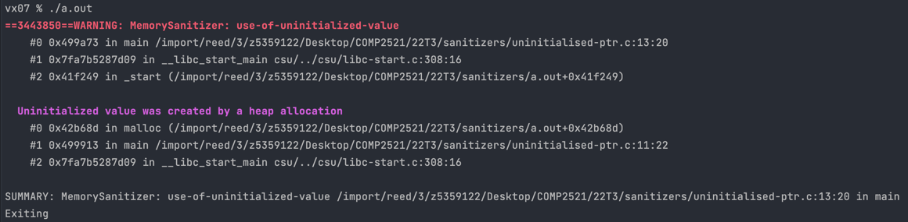

[Back to use-of-uninitialized-value](..)

# Uninitialised Pointer

## The Code

Here is the code for this example ([source](uninitialised-ptr.c)):

```c
// Created for COMP2521 sanitiser guide

#include <stdlib.h>

struct node {
    int value;
    struct node *next;
};

int main(void) {
    struct node *n = malloc(sizeof(*n));
    n->value = 0;
    n->next->value = 1;
}

```

This code tries to create a linked list containing the values `0` and `1`.

## The Error

Here is the error message:



- The error occurs on line 13 - `n->next->value = 1;`
- The uninitialised value was originally created on line 11 - `struct node *n = malloc(sizeof(*n));`

## The Problem

On line 13, we try to set the `value` field of `n->next`. However, when we allocated memory for `n` we never initialised `n->next`, so trying to write to this pointer causes an error.

## The Fix

We need to initialise `n->next` by allocating memory to it (i.e. `n->next = malloc(...)`).