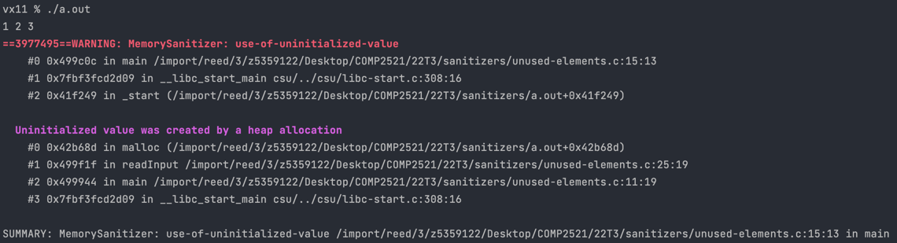

[Back to use-of-uninitialized-value](..)

# Accessing Unused Array Elements

## The Code

Here is the code for this example ([source](unused-elements.c)):

```c
// Created for COMP2521 sanitiser guide

#include <stdio.h>
#include <stdlib.h>

#define MAX_INPUTS 10

int *readInput(void);

int main(void) {
    int *inputs = readInput();
    
    int evens = 0;
    for (int i = 0; i < MAX_INPUTS; i++) {
        if (inputs[i] % 2 == 0) {
            evens++;
        }
    }
    printf("%d\n", evens);
    
    free(inputs);
}

int *readInput(void) {
    int *inputs = malloc(MAX_INPUTS * sizeof(int));
    
    // Read until MAX_INPUTS read or EOF
    int input;
    int count = 0;
    while (count < MAX_INPUTS && scanf("%d", &input) != EOF) {
        inputs[count++] = input;
    }
    
    return inputs;
}

```

This code reads up to 10 inputs and counts the number of even numbers that were input. Input is read via `readInput()` which calls `scanf()` until 10 inputs have been read, or the user presses `CTRL + D` (EOF).

## The Error

Here is the error message when we gave an input of "1 2 3":



- The error occurs on line 15 in `main()` which is - `if (inputs[i] % 2 == 0) {`
- The uninitialised value was originally created on line 25 in `readInput()` which we called on line 11 of `main()`
- Line 25 is `int *inputs = malloc(MAX_INPUTS * sizeof(int));`

## The Problem

While we do allocate an array large enough to store the maximum possible number of inputs, the actual number of inputs stored in to the array depends on user input. The rest of the array that is unused contains uninitialised values.

In our main function, we don't know how many inputs were actually read. When we iterate through the array, we iterate through it fully since we don't know where to stop. This means that we eventually run into the unused/uninitialised section and get an error.

## The Fix

This is a common pattern, where we create a large array to store the maximum possible items, but actually store a smaller number of items depending on input. There are two main approaches to handling this.

One is to have `readInput()` return the size, and take in a `malloc()`'d array to populate as an argument. We then use the returned size when we want to iterate through the inputs. Here's the above code rewritten with this approach ([source](fix1.c)):
```c
int readInput(int *array);

int main(void) {
    int *inputs = malloc(MAX_INPUTS * sizeof(int));
    int numInputs = readInput(array);

    int evens = 0;
    for (int i = 0; i < numInputs; i++) {
        if (inputs[i] % 2 == 0) {
            evens++;
        }
    }
    printf("%d\n", evens);

    free(inputs);
}

int readInput(int *array) {
    // Read until MAX_INPUTS read or EOF
    int input;
    int count = 0;
    while (count < MAX_INPUTS && scanf("%d", &input) != EOF) {
        array[count++] = input;
    }

    return count;
}

```

The other approach is to sort of flip it around so that we return a `malloc()`'d array and take in a pointer to a variable to store the count in.  One advantage here is that `readInput()` gets to control how big the `malloc()`'d array is, rather than trust that the caller made it big enough. Here's the above code rewritten with this approach ([source](fix2.c)):

```c
int *readInput(int *countPtr);

int main(void) {
    int numInputs;
    int *inputs = readInput(&numInputs);

    int evens = 0;
    for (int i = 0; i < numInputs; i++) {
        if (inputs[i] % 2 == 0) {
            evens++;
        }
    }
    printf("%d\n", evens);

    free(inputs);
}

int *readInput(int *countPtr) {
    int *inputs = malloc(MAX_INPUTS * sizeof(int));

    // Read until MAX_INPUTS read or EOF
    int input;
    *count = 0;
    while (*count < MAX_INPUTS && scanf("%d", &input) != EOF) {
        inputs[(*count)++] = input;
    }

    return inputs;
}

```