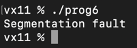
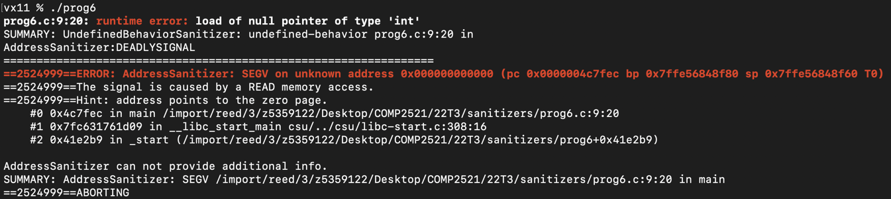
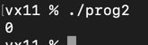
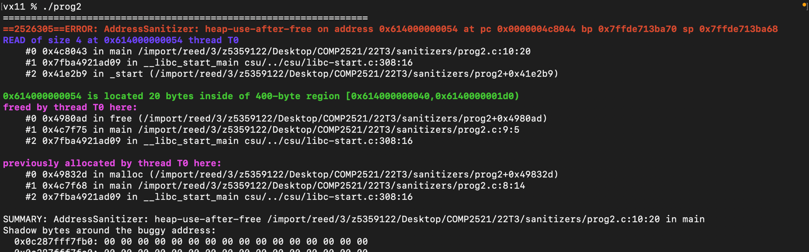

[Back to top](..)

# About Sanitisers
- [What is a sanitiser?](#what-is-a-sanitiser)
  - [Error Reporting](#error-reporting)
  - [Error Checking](#error-checking)
- [What sanitisers are there?](#what-sanitisers-are-there)
- [How do I use sanitisers?](#how-do-i-use-sanitisers)

## What is a sanitiser?

Santisers are tools you can compile along with your code to add additional error checking and reporting.

### Error Reporting

Their most important use is giving detailed error messages to aid debugging. Consider the following C program which dereferences a NULL pointer:
```c
int main(void) {
    int *ptr = NULL;
    printf("%d\n", *ptr);
}
```

If we compile and run this program without sanitisers, you will get the following output, which is not very helpful:



However, with sanitisers included, we get the following much more helpful output that tells us exactly what went wrong and where:



### Error Checking

Sanitisers can also reveal errors that may have gone unnoticed otherwise and help keep your code bug free. For example, consider this C program that accesses an array after it has been freed:

```C
int main(void) {
    int *a = malloc(sizeof(int) * 100);
    free(a);
    printf("%d\n", a[5]);
}
```

If we compile and run this program without sanitisers, this will run without issues:



However, we know accessing memory after it has been freed is invalid, and our sanitisers can catch this error:




## What sanitisers are there?

* **AddressSanitizer** or **ASan** is for catching various memory errors such as accessing unallocated memory. A full list of checks can be found [here](https://clang.llvm.org/docs/AddressSanitizer.html#introduction). You can use it with `fsanitize=address`.
* **LeakSanitizer** or **LSan** is for catching memory leaks. You can use it with `fsanitize=leak`.
* **MemorySanitizer** or **MSan** is for detecting reads of uninitialised memory - that is, trying to read memory before it is written. You can use it with `fsanitize=memory`.
* **UndefinedBehaviorSanitizer** or **UBSan** is for catching various kinds of undefined behavior such as dividing by zero. A full list of checks can be found [here](https://clang.llvm.org/docs/UndefinedBehaviorSanitizer.html#ubsan-checks). You can use it with `fsanitize=undefined`.

## How do I use sanitisers?

To compile your code with sanitizers, you need to the add `fsanitize` flag to your compilation command. Most of the Makefiles we provide already have this flag added for you.

For example, to compile with AddressSanitizer and LeakSanitizer you would do something like

```
clang -o myProgram myProgram.c -fsanitize=address,leak
```

As shown above, multiple sanitisers are chained together with commas. 

**Note:** If you're working locally on a Mac you may get an error when trying to compile with LeakSanitizer as it is not installed by default. Please follow [these steps](https://stackoverflow.com/a/55778432) to install it.

**Note 2:** Some sanitisers are not compatible with each other. Specifically, MSan is incompatible with ASan and LSan, so to check for the entire range of errors you would need to compile once with ASan and LSan (and UBSan), and compile again with MSan.
